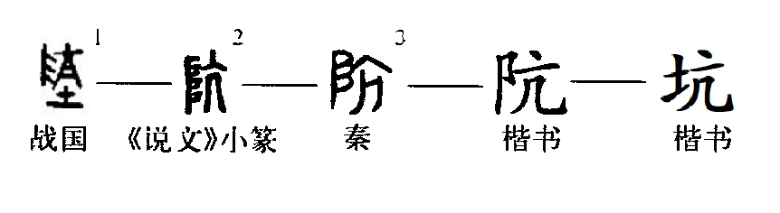

# 前言

## Keng

“Keng”，学名坑，是汉语通用规范一级汉字，读作：kēng，由“亢”和“土”构成。阬是坑的异体字，始见于篆书，本义是沟壑或地面凹陷处，引申表示坑害、地洞、陷阱、洼下去的地方等。

当然，此坑非彼坑，这里的坑是虚拟的二进制世界的坑，它藏匿在代码之中，表面上看上去光鲜亮丽，代码逻辑整密，实则千疮百孔，无从下手。

有人为坑加班，有人为坑挑灯夜战，有人为坑一夜不眠。（当然，摆烂就好了，哪还有什么坑）

我们知道，坑是版本迭代遗留下来的兼容问题，或是源代码考虑的不够周全，又或是个bug🛠。

但是，坑是我们成为合格码农👴的必经之路，不入“坑”，何成仙🤺。

让我们一起踩坑，快乐踩坑😀，毕竟，这世上本没有坑，踩的人多也便成了坑。

成长吧！Keng友们，踩坑不可怕，可怕的在一个坑上来回踩🤡。

踩坑使人成长，使人抓耳挠腮，使人打开浏览器就是几十个页签。

你还在为踩坑烦恼吗？不如先把坑都踩了，让自己无坑可踩🏆。

没错这就是KengBook！让你无法自拔的Keng。

## 介绍

这是一本菜鸡的踩坑指南，也是对自己一路学习过程中踩到的各种坑进行记录。

本书目前规划从以下部分展开（如果你有更好的建议，或想一起贡献，欢迎邮件jackcc0701@163.com或者在issue中提出建议）：

- 操作系统：包括Linux，Window，MacOS使用遇到的坑
- 环境配置：编程语言或环境配置过程的各种坑
- 实际开发：开发过程遇到的各种坑
- 运营维护：运维中遇到的各种坑

## 为什么要写KengBook？

踩坑是让人最头疼的事情，但是每次踩到坑会去网上搜索问题，回答更是杂乱，什么都有，没有统一的解决方案，经常要一起尝试好几种方案才能解决，让我们在坑上花了太多没有必要的时间，毕竟，时间就是金钱，少踩坑，多出来的时间不妨看看外面的世界，多陪陪亲人，享受一下生活。何必每天为坑苦恼。因此，这里想制作KengBook来作为排坑的速查手册，快速解决我们我们遇到的坑！

## 致谢

还没有致谢。

© [KengBook](https://github.com/JackHCC/Fucking-Keng)

